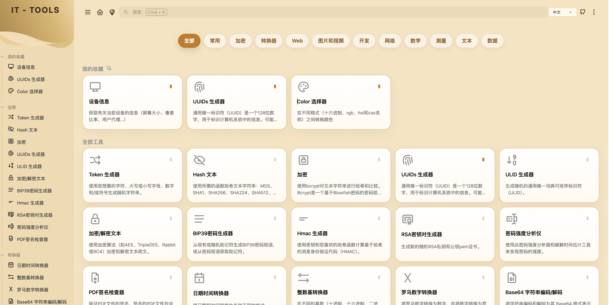

<picture>
    <source srcset="./.github/logo-dark.png" media="(prefers-color-scheme: light)">
    <source srcset="./.github/logo-white.png" media="(prefers-color-scheme: dark)">
    
</picture>

<p align="center">
面向开发者和 IT 工作者的实用工具集合。<a href="https://it-tools.tech">在线体验</a>
</p>

## 简介

IT-Tools 是一个基于 Vue 3 的在线工具集合，适合开发、排查、转换、格式化等日常场景。

这个 fork 主要做了三件事：

- 把首页改成路由驱动的分类目录页
- 把收藏改成 Cloudflare D1 持久化，同步到不同浏览器和设备
- 把部署方式整理为 Cloudflare Pages + Cloudflare Access + D1

## 页面结构

生产环境主要有这些页面和接口：

- `/`：全部工具页
- `/favorites`：常用 / 收藏页
- `/category/:slug`：单个分类页
- `/api/me`：当前登录身份
- `/api/favorites`：收藏读取与保存

## 首页说明

顶部分类 tabs 的作用如下：

- `全部`
  - 保留首页介绍区、最新工具和全部工具列表
- `常用`
  - 直接显示收藏工具
  - 支持拖拽调整顺序
- 其它分类
  - 只显示对应分类下的工具
  - 可以直接刷新和分享链接

## 收藏功能

收藏功能已经从纯本地存储改成远端同步：

- 登录后收藏会写入 D1
- 换浏览器、换设备后仍然保留
- 收藏顺序也会一起保存
- 未登录或未启用 Access 时，会自动降级到本地缓存

## Cloudflare 部署

推荐的部署方式是：

- Cloudflare Pages 负责静态站点托管
- Cloudflare Access 负责登录控制
- Cloudflare D1 负责收藏持久化

### 快速部署

1. 在 Cloudflare Pages 创建项目
2. 构建目录选择 `dist`
3. 绑定 D1 数据库 `it-tools-favorites`
4. 配置自定义域名或直接使用 `*.pages.dev`
5. 如需登录控制，在 Zero Trust 里添加 Access self-hosted app
6. 在 Access 中添加允许访问的邮箱或邮箱组

### 不启用 Zero Trust 会怎样

如果不启用 Access，也可以正常部署和访问，只是会少掉这些能力：

- `/api/me` 会返回 `401`
- `/api/favorites` 会返回 `401`
- 收藏无法跨浏览器同步，只能保存在本地
- 换浏览器或换设备后，收藏会丢失

换句话说：

- **不启用 Zero Trust，不影响站点正常使用**
- **主要影响是登录控制和跨浏览器收藏同步**

## 本地开发

### 安装依赖

```sh
pnpm install
```

### 本地启动

```sh
pnpm dev
```

### 构建生产版本

```sh
pnpm build
```

### 运行单元测试

```sh
pnpm test
```

### 代码检查

```sh
pnpm lint
```

## 创建新工具

如果要新增一个工具，可以运行：

```sh
pnpm run script:create:tool my-tool-name
```

脚本会在 `src/tools` 下生成基础文件，并自动把它挂到工具注册中。然后你只需要把它放到对应分类里，再完善具体实现。

## 贡献

### 推荐编辑器设置

建议使用 [VSCode](https://code.visualstudio.com/) 并安装这些扩展：

- [Volar](https://marketplace.visualstudio.com/items?itemName=Vue.volar)
- [TypeScript Vue Plugin (Volar)](https://marketplace.visualstudio.com/items?itemName=Vue.vscode-typescript-vue-plugin)
- [ESLint](https://marketplace.visualstudio.com/items?itemName=dbaeumer.vscode-eslint)
- [i18n Ally](https://marketplace.visualstudio.com/items?itemName=lokalise.i18n-ally)

推荐设置：

```json
{
  "editor.formatOnSave": false,
  "editor.codeActionsOnSave": {
    "source.fixAll.eslint": true
  },
  "i18n-ally.localesPaths": ["locales", "src/tools/*/locales"],
  "i18n-ally.keystyle": "nested"
}
```

### 项目开发

```sh
pnpm install
pnpm dev
pnpm build
pnpm test
pnpm lint
```

## 致谢

感谢所有贡献者。

[](https://github.com/corentinth/it-tools/graphs/contributors)

## 许可证

本项目采用 [GNU GPLv3](LICENSE) 许可证。
